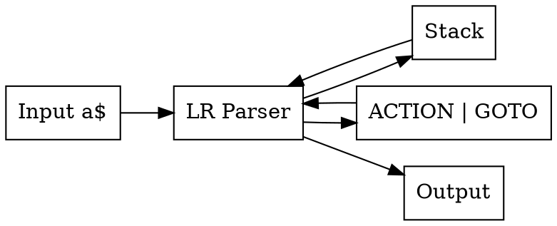

<style>
/* Remove the white background from the initial polygon */
polygon[fill="white"] {
  fill: none !important;
}

/* Style for all path and ellipse elements (lines, arrows, circles) */
.graph path, .graph ellipse {
  stroke: white !important;
  fill: none !important; /* Ensures state fills are transparent/none */
}

/* Style for all text (state names, transition symbols) */
.graph text {
  fill: white !important;
}

/* Specific fix for final state rings and arrow heads */
.graph polygon[fill="black"] {
  fill: white !important;
  stroke: white !important;
}
</style>

## Chapter 2: Syntactic Analysis

### 2.1 Introduction to Syntax Analysis

Syntax analysis (parsing) checks if the token sequence conforms to the grammar rules and builds a parse tree.

**Input:** Token stream from lexical analyzer  
**Output:** Parse tree or syntax tree

### 2.2 Context-Free Grammars (CFG)

A grammar $G$ is defined as: $G = (N, T, P, S)$

- $N$: Set of non-terminals
- $T$: Set of terminals (tokens)
- $P$: Set of production rules
- $S$: Start symbol

**Example Grammar:**
```
E → E + T | T
T → T * F | F
F → (E) | id
```


**$ N $ (Non-terminals)**:  
  $ \{ E, T, F \} $  
  → These are variables that can be expanded.

**$ T $ (Terminals)**:  
  $ \{ +, *, (, ), \text{id} \} $  
  → These are literal symbols in the language (operators, parentheses, identifiers).

**$ P $ (Production Rules)**:  
  $$
  \begin{align*}
  E &\to E + T \\
  E &\to T \\
  T &\to T * F \\
  T &\to F \\
  F &\to (E) \\
  F &\to \text{id}
  \end{align*}
  $$

**$ S $ (Start Symbol)**:  
  $ E $  
  → The grammar starts with `E`.

---


### 2.3 Derivations and Parse Trees

**Leftmost Derivation:** Always expand the leftmost non-terminal first  
**Rightmost Derivation:** Always expand the rightmost non-terminal first

**Example for `id + id * id`:**

Leftmost derivation:
```python
E
⇒ E + T              (expand **E → E + T**)
⇒ T + T              (expand **leftmost E → T**)
⇒ F + T              (expand **leftmost T → F**)
⇒ id + T             (expand **F → id**)
⇒ id + T * F         (expand **T → T * F**)
⇒ id + F * F         (expand **leftmost T → F**)
⇒ id + id * F        (expand **F → id**)
⇒ id + id * id       (expand **F → id**)
```
<svg xmlns="http://www.w3.org/2000/svg" xmlns:xlink="http://www.w3.org/1999/xlink" width="250pt" height="386pt" viewBox="0.00 0.00 250.00 386.00">
<g id="graph0" class="graph" transform="scale(1 1) rotate(0) translate(4 382)">
<title>ParseTree</title>
<!-- E1 -->
<g id="node1" class="node">
<title>E1</title>
<ellipse fill="none" stroke="white" cx="88.4" cy="-354.6" rx="23.4" ry="23.4"/>
<text xml:space="preserve" text-anchor="middle" x="88.4" y="-348.6" font-family="Arial" font-size="20.00" fill="white">E</text>
</g>
<!-- E2 -->
<g id="node2" class="node">
<title>E2</title>
<ellipse fill="none" stroke="white" cx="23.4" cy="-271.8" rx="23.4" ry="23.4"/>
<text xml:space="preserve" text-anchor="middle" x="23.4" y="-265.8" font-family="Arial" font-size="20.00" fill="white">E</text>
</g>
<!-- E1&#45;&gt;E2 -->
<g id="edge1" class="edge">
<title>E1-&gt;E2</title>
<path fill="none" stroke="white" stroke-width="1.2" d="M73.97,-335.67C65.47,-325.1 54.56,-311.53 45.04,-299.7"/>
<polygon fill="white" stroke="white" stroke-width="1.2" points="47.92,-297.7 38.92,-292.1 42.46,-302.08 47.92,-297.7"/>
</g>
<!-- plus -->
<g id="node3" class="node">
<title>plus</title>
<ellipse fill="none" stroke="white" cx="88.4" cy="-271.8" rx="23.4" ry="23.4"/>
<text xml:space="preserve" text-anchor="middle" x="88.4" y="-265.8" font-family="Arial" font-size="20.00" fill="white">+</text>
</g>
<!-- E1&#45;&gt;plus -->
<g id="edge2" class="edge">
<title>E1-&gt;plus</title>
<path fill="none" stroke="white" stroke-width="1.2" d="M88.4,-331.09C88.4,-323.71 88.4,-315.33 88.4,-307.28"/>
<polygon fill="white" stroke="white" stroke-width="1.2" points="91.9,-307.28 88.4,-297.28 84.9,-307.28 91.9,-307.28"/>
</g>
<!-- T1 -->
<g id="node4" class="node">
<title>T1</title>
<ellipse fill="none" stroke="white" cx="153.4" cy="-271.8" rx="23.4" ry="23.4"/>
<text xml:space="preserve" text-anchor="middle" x="153.4" y="-265.8" font-family="Arial" font-size="20.00" fill="white">T</text>
</g>
<!-- E1&#45;&gt;T1 -->
<g id="edge3" class="edge">
<title>E1-&gt;T1</title>
<path fill="none" stroke="white" stroke-width="1.2" d="M102.83,-335.67C111.33,-325.1 122.24,-311.53 131.76,-299.7"/>
<polygon fill="white" stroke="white" stroke-width="1.2" points="134.34,-302.08 137.88,-292.1 128.88,-297.7 134.34,-302.08"/>
</g>
<!-- T2 -->
<g id="node5" class="node">
<title>T2</title>
<ellipse fill="none" stroke="white" cx="23.4" cy="-189" rx="23.4" ry="23.4"/>
<text xml:space="preserve" text-anchor="middle" x="23.4" y="-183" font-family="Arial" font-size="20.00" fill="white">T</text>
</g>
<!-- E2&#45;&gt;T2 -->
<g id="edge4" class="edge">
<title>E2-&gt;T2</title>
<path fill="none" stroke="white" stroke-width="1.2" d="M23.4,-248.29C23.4,-240.91 23.4,-232.53 23.4,-224.48"/>
<polygon fill="white" stroke="white" stroke-width="1.2" points="26.9,-224.48 23.4,-214.48 19.9,-224.48 26.9,-224.48"/>
</g>
<!-- T3 -->
<g id="node6" class="node">
<title>T3</title>
<ellipse fill="none" stroke="white" cx="88.4" cy="-189" rx="23.4" ry="23.4"/>
<text xml:space="preserve" text-anchor="middle" x="88.4" y="-183" font-family="Arial" font-size="20.00" fill="white">T</text>
</g>
<!-- T1&#45;&gt;T3 -->
<g id="edge7" class="edge">
<title>T1-&gt;T3</title>
<path fill="none" stroke="white" stroke-width="1.2" d="M138.97,-252.87C130.47,-242.3 119.56,-228.73 110.04,-216.9"/>
<polygon fill="white" stroke="white" stroke-width="1.2" points="112.92,-214.9 103.92,-209.3 107.46,-219.28 112.92,-214.9"/>
</g>
<!-- star -->
<g id="node7" class="node">
<title>star</title>
<ellipse fill="none" stroke="white" cx="153.4" cy="-189" rx="23.4" ry="23.4"/>
<text xml:space="preserve" text-anchor="middle" x="153.4" y="-183" font-family="Arial" font-size="20.00" fill="white">*</text>
</g>
<!-- T1&#45;&gt;star -->
<g id="edge8" class="edge">
<title>T1-&gt;star</title>
<path fill="none" stroke="white" stroke-width="1.2" d="M153.4,-248.29C153.4,-240.91 153.4,-232.53 153.4,-224.48"/>
<polygon fill="white" stroke="white" stroke-width="1.2" points="156.9,-224.48 153.4,-214.48 149.9,-224.48 156.9,-224.48"/>
</g>
<!-- F1 -->
<g id="node8" class="node">
<title>F1</title>
<ellipse fill="none" stroke="white" cx="218.4" cy="-189" rx="23.4" ry="23.4"/>
<text xml:space="preserve" text-anchor="middle" x="218.4" y="-183" font-family="Arial" font-size="20.00" fill="white">F</text>
</g>
<!-- T1&#45;&gt;F1 -->
<g id="edge9" class="edge">
<title>T1-&gt;F1</title>
<path fill="none" stroke="white" stroke-width="1.2" d="M167.83,-252.87C176.33,-242.3 187.24,-228.73 196.76,-216.9"/>
<polygon fill="white" stroke="white" stroke-width="1.2" points="199.34,-219.28 202.88,-209.3 193.88,-214.9 199.34,-219.28"/>
</g>
<!-- F2 -->
<g id="node9" class="node">
<title>F2</title>
<ellipse fill="none" stroke="white" cx="23.4" cy="-106.2" rx="23.4" ry="23.4"/>
<text xml:space="preserve" text-anchor="middle" x="23.4" y="-100.2" font-family="Arial" font-size="20.00" fill="white">F</text>
</g>
<!-- T2&#45;&gt;F2 -->
<g id="edge5" class="edge">
<title>T2-&gt;F2</title>
<path fill="none" stroke="white" stroke-width="1.2" d="M23.4,-165.49C23.4,-158.11 23.4,-149.73 23.4,-141.68"/>
<polygon fill="white" stroke="white" stroke-width="1.2" points="26.9,-141.68 23.4,-131.68 19.9,-141.68 26.9,-141.68"/>
</g>
<!-- F3 -->
<g id="node10" class="node">
<title>F3</title>
<ellipse fill="none" stroke="white" cx="88.4" cy="-106.2" rx="23.4" ry="23.4"/>
<text xml:space="preserve" text-anchor="middle" x="88.4" y="-100.2" font-family="Arial" font-size="20.00" fill="white">F</text>
</g>
<!-- T3&#45;&gt;F3 -->
<g id="edge10" class="edge">
<title>T3-&gt;F3</title>
<path fill="none" stroke="white" stroke-width="1.2" d="M88.4,-165.49C88.4,-158.11 88.4,-149.73 88.4,-141.68"/>
<polygon fill="white" stroke="white" stroke-width="1.2" points="91.9,-141.68 88.4,-131.68 84.9,-141.68 91.9,-141.68"/>
</g>
<!-- id1 -->
<g id="node11" class="node">
<title>id1</title>
<ellipse fill="none" stroke="white" cx="218.4" cy="-106.2" rx="23.4" ry="23.4"/>
<text xml:space="preserve" text-anchor="middle" x="218.4" y="-100.2" font-family="Arial" font-size="20.00" fill="white">id</text>
</g>
<!-- F1&#45;&gt;id1 -->
<g id="edge12" class="edge">
<title>F1-&gt;id1</title>
<path fill="none" stroke="white" stroke-width="1.2" d="M218.4,-165.49C218.4,-158.11 218.4,-149.73 218.4,-141.68"/>
<polygon fill="white" stroke="white" stroke-width="1.2" points="221.9,-141.68 218.4,-131.68 214.9,-141.68 221.9,-141.68"/>
</g>
<!-- id2 -->
<g id="node12" class="node">
<title>id2</title>
<ellipse fill="none" stroke="white" cx="23.4" cy="-23.4" rx="23.4" ry="23.4"/>
<text xml:space="preserve" text-anchor="middle" x="23.4" y="-17.4" font-family="Arial" font-size="20.00" fill="white">id</text>
</g>
<!-- F2&#45;&gt;id2 -->
<g id="edge6" class="edge">
<title>F2-&gt;id2</title>
<path fill="none" stroke="white" stroke-width="1.2" d="M23.4,-82.69C23.4,-75.31 23.4,-66.93 23.4,-58.88"/>
<polygon fill="white" stroke="white" stroke-width="1.2" points="26.9,-58.88 23.4,-48.88 19.9,-58.88 26.9,-58.88"/>
</g>
<!-- id3 -->
<g id="node13" class="node">
<title>id3</title>
<ellipse fill="none" stroke="white" cx="88.4" cy="-23.4" rx="23.4" ry="23.4"/>
<text xml:space="preserve" text-anchor="middle" x="88.4" y="-17.4" font-family="Arial" font-size="20.00" fill="white">id</text>
</g>
<!-- F3&#45;&gt;id3 -->
<g id="edge11" class="edge">
<title>F3-&gt;id3</title>
<path fill="none" stroke="white" stroke-width="1.2" d="M88.4,-82.69C88.4,-75.31 88.4,-66.93 88.4,-58.88"/>
<polygon fill="white" stroke="white" stroke-width="1.2" points="91.9,-58.88 88.4,-48.88 84.9,-58.88 91.9,-58.88"/>
</g>
</g>
</svg>

Rightmost derivation:
```python
E
⇒ E + T             (use E → E + T)
⇒ E + T * F         (expand rightmost T → T * F)
⇒ E + T * id        (expand F → id)
⇒ E + F * id        (expand rightmost T → F)
⇒ E + id * id       (expand F → id)
⇒ T + id * id       (expand E → T)
⇒ F + id * id       (expand T → F)
⇒ id + id * id      (expand F → id)
```
<svg xmlns="http://www.w3.org/2000/svg" xmlns:xlink="http://www.w3.org/1999/xlink" width="250pt" height="386pt" viewBox="0.00 0.00 250.00 386.00">
<g id="graph0" class="graph" transform="scale(1 1) rotate(0) translate(4 382)">
<title>ParseTree</title>
<!-- E1 -->
<g id="node1" class="node">
<title>E1</title>
<ellipse fill="none" stroke="white" cx="153.4" cy="-354.6" rx="23.4" ry="23.4"/>
<text xml:space="preserve" text-anchor="middle" x="153.4" y="-348" font-family="Arial" font-size="22.00" fill="white">E</text>
</g>
<!-- T1 -->
<g id="node2" class="node">
<title>T1</title>
<ellipse fill="none" stroke="white" cx="88.4" cy="-271.8" rx="23.4" ry="23.4"/>
<text xml:space="preserve" text-anchor="middle" x="88.4" y="-265.2" font-family="Arial" font-size="22.00" fill="white">T</text>
</g>
<!-- E1&#45;&gt;T1 -->
<g id="edge1" class="edge">
<title>E1-&gt;T1</title>
<path fill="none" stroke="white" stroke-width="1.2" d="M138.97,-335.67C130.47,-325.1 119.56,-311.53 110.04,-299.7"/>
<polygon fill="white" stroke="white" stroke-width="1.2" points="112.92,-297.7 103.92,-292.1 107.46,-302.08 112.92,-297.7"/>
</g>
<!-- plus -->
<g id="node3" class="node">
<title>plus</title>
<ellipse fill="none" stroke="white" cx="153.4" cy="-271.8" rx="23.4" ry="23.4"/>
<text xml:space="preserve" text-anchor="middle" x="153.4" y="-265.2" font-family="Arial" font-size="22.00" fill="white">+</text>
</g>
<!-- E1&#45;&gt;plus -->
<g id="edge2" class="edge">
<title>E1-&gt;plus</title>
<path fill="none" stroke="white" stroke-width="1.2" d="M153.4,-331.09C153.4,-323.71 153.4,-315.33 153.4,-307.28"/>
<polygon fill="white" stroke="white" stroke-width="1.2" points="156.9,-307.28 153.4,-297.28 149.9,-307.28 156.9,-307.28"/>
</g>
<!-- E2 -->
<g id="node4" class="node">
<title>E2</title>
<ellipse fill="none" stroke="white" cx="218.4" cy="-271.8" rx="23.4" ry="23.4"/>
<text xml:space="preserve" text-anchor="middle" x="218.4" y="-265.2" font-family="Arial" font-size="22.00" fill="white">E</text>
</g>
<!-- E1&#45;&gt;E2 -->
<g id="edge3" class="edge">
<title>E1-&gt;E2</title>
<path fill="none" stroke="white" stroke-width="1.2" d="M167.83,-335.67C176.33,-325.1 187.24,-311.53 196.76,-299.7"/>
<polygon fill="white" stroke="white" stroke-width="1.2" points="199.34,-302.08 202.88,-292.1 193.88,-297.7 199.34,-302.08"/>
</g>
<!-- T2 -->
<g id="node5" class="node">
<title>T2</title>
<ellipse fill="none" stroke="white" cx="23.4" cy="-189" rx="23.4" ry="23.4"/>
<text xml:space="preserve" text-anchor="middle" x="23.4" y="-182.4" font-family="Arial" font-size="22.00" fill="white">T</text>
</g>
<!-- T1&#45;&gt;T2 -->
<g id="edge4" class="edge">
<title>T1-&gt;T2</title>
<path fill="none" stroke="white" stroke-width="1.2" d="M73.97,-252.87C65.47,-242.3 54.56,-228.73 45.04,-216.9"/>
<polygon fill="white" stroke="white" stroke-width="1.2" points="47.92,-214.9 38.92,-209.3 42.46,-219.28 47.92,-214.9"/>
</g>
<!-- star -->
<g id="node6" class="node">
<title>star</title>
<ellipse fill="none" stroke="white" cx="88.4" cy="-189" rx="23.4" ry="23.4"/>
<text xml:space="preserve" text-anchor="middle" x="88.4" y="-182.4" font-family="Arial" font-size="22.00" fill="white">*</text>
</g>
<!-- T1&#45;&gt;star -->
<g id="edge5" class="edge">
<title>T1-&gt;star</title>
<path fill="none" stroke="white" stroke-width="1.2" d="M88.4,-248.29C88.4,-240.91 88.4,-232.53 88.4,-224.48"/>
<polygon fill="white" stroke="white" stroke-width="1.2" points="91.9,-224.48 88.4,-214.48 84.9,-224.48 91.9,-224.48"/>
</g>
<!-- F1 -->
<g id="node7" class="node">
<title>F1</title>
<ellipse fill="none" stroke="white" cx="153.4" cy="-189" rx="23.4" ry="23.4"/>
<text xml:space="preserve" text-anchor="middle" x="153.4" y="-182.4" font-family="Arial" font-size="22.00" fill="white">F</text>
</g>
<!-- T1&#45;&gt;F1 -->
<g id="edge6" class="edge">
<title>T1-&gt;F1</title>
<path fill="none" stroke="white" stroke-width="1.2" d="M102.83,-252.87C111.33,-242.3 122.24,-228.73 131.76,-216.9"/>
<polygon fill="white" stroke="white" stroke-width="1.2" points="134.34,-219.28 137.88,-209.3 128.88,-214.9 134.34,-219.28"/>
</g>
<!-- T3 -->
<g id="node8" class="node">
<title>T3</title>
<ellipse fill="none" stroke="white" cx="218.4" cy="-189" rx="23.4" ry="23.4"/>
<text xml:space="preserve" text-anchor="middle" x="218.4" y="-182.4" font-family="Arial" font-size="22.00" fill="white">T</text>
</g>
<!-- E2&#45;&gt;T3 -->
<g id="edge7" class="edge">
<title>E2-&gt;T3</title>
<path fill="none" stroke="white" stroke-width="1.2" d="M218.4,-248.29C218.4,-240.91 218.4,-232.53 218.4,-224.48"/>
<polygon fill="white" stroke="white" stroke-width="1.2" points="221.9,-224.48 218.4,-214.48 214.9,-224.48 221.9,-224.48"/>
</g>
<!-- F2 -->
<g id="node9" class="node">
<title>F2</title>
<ellipse fill="none" stroke="white" cx="23.4" cy="-106.2" rx="23.4" ry="23.4"/>
<text xml:space="preserve" text-anchor="middle" x="23.4" y="-99.6" font-family="Arial" font-size="22.00" fill="white">F</text>
</g>
<!-- T2&#45;&gt;F2 -->
<g id="edge8" class="edge">
<title>T2-&gt;F2</title>
<path fill="none" stroke="white" stroke-width="1.2" d="M23.4,-165.49C23.4,-158.11 23.4,-149.73 23.4,-141.68"/>
<polygon fill="white" stroke="white" stroke-width="1.2" points="26.9,-141.68 23.4,-131.68 19.9,-141.68 26.9,-141.68"/>
</g>
<!-- id1 -->
<g id="node10" class="node">
<title>id1</title>
<ellipse fill="none" stroke="white" cx="153.4" cy="-106.2" rx="23.4" ry="23.4"/>
<text xml:space="preserve" text-anchor="middle" x="153.4" y="-99.6" font-family="Arial" font-size="22.00" fill="white">id</text>
</g>
<!-- F1&#45;&gt;id1 -->
<g id="edge10" class="edge">
<title>F1-&gt;id1</title>
<path fill="none" stroke="white" stroke-width="1.2" d="M153.4,-165.49C153.4,-158.11 153.4,-149.73 153.4,-141.68"/>
<polygon fill="white" stroke="white" stroke-width="1.2" points="156.9,-141.68 153.4,-131.68 149.9,-141.68 156.9,-141.68"/>
</g>
<!-- F3 -->
<g id="node11" class="node">
<title>F3</title>
<ellipse fill="none" stroke="white" cx="218.4" cy="-106.2" rx="23.4" ry="23.4"/>
<text xml:space="preserve" text-anchor="middle" x="218.4" y="-99.6" font-family="Arial" font-size="22.00" fill="white">F</text>
</g>
<!-- T3&#45;&gt;F3 -->
<g id="edge11" class="edge">
<title>T3-&gt;F3</title>
<path fill="none" stroke="white" stroke-width="1.2" d="M218.4,-165.49C218.4,-158.11 218.4,-149.73 218.4,-141.68"/>
<polygon fill="white" stroke="white" stroke-width="1.2" points="221.9,-141.68 218.4,-131.68 214.9,-141.68 221.9,-141.68"/>
</g>
<!-- id2 -->
<g id="node12" class="node">
<title>id2</title>
<ellipse fill="none" stroke="white" cx="23.4" cy="-23.4" rx="23.4" ry="23.4"/>
<text xml:space="preserve" text-anchor="middle" x="23.4" y="-16.8" font-family="Arial" font-size="22.00" fill="white">id</text>
</g>
<!-- F2&#45;&gt;id2 -->
<g id="edge9" class="edge">
<title>F2-&gt;id2</title>
<path fill="none" stroke="white" stroke-width="1.2" d="M23.4,-82.69C23.4,-75.31 23.4,-66.93 23.4,-58.88"/>
<polygon fill="white" stroke="white" stroke-width="1.2" points="26.9,-58.88 23.4,-48.88 19.9,-58.88 26.9,-58.88"/>
</g>
<!-- id3 -->
<g id="node13" class="node">
<title>id3</title>
<ellipse fill="none" stroke="white" cx="218.4" cy="-23.4" rx="23.4" ry="23.4"/>
<text xml:space="preserve" text-anchor="middle" x="218.4" y="-16.8" font-family="Arial" font-size="22.00" fill="white">id</text>
</g>
<!-- F3&#45;&gt;id3 -->
<g id="edge12" class="edge">
<title>F3-&gt;id3</title>
<path fill="none" stroke="white" stroke-width="1.2" d="M218.4,-82.69C218.4,-75.31 218.4,-66.93 218.4,-58.88"/>
<polygon fill="white" stroke="white" stroke-width="1.2" points="221.9,-58.88 218.4,-48.88 214.9,-58.88 221.9,-58.88"/>
</g>
</g>
</svg>

### 2.4 Problems in Grammar Design

#### 2.4.1 Ambiguity

A grammar is ambiguous if there exists a string with two or more distinct parse trees.

**Ambiguous Grammar:**
```python
E → E + E
E → E * E
E → id
```

For the string `id + id * id`, we can have:

`(id + id) * id`  
`id + (id * id)`

**Solution:** Use precedence and associativity rules.

**Fix (Unambiguous Grammar):**
```
E → E + T | T
T → T * F | F
F → id
```

#### 2.4.2 Left Recursion

A grammar is **left-recursive** if a nonterminal `A` can derive a string that begins with itself, i.e. `A ⇒⁺ Aα`.

**Problem:**
Top-down parsers can fall into **infinite recursion** when handling left-recursive rules.

**Example:**

```
E → E + T | T
```

Here, `E` is left-recursive because the production `E → E + T` starts with `E`.

**Elimination Algorithm:**
For a rule of the form:

```c
A → Aα | β //   βαααα..α | β
```

We rewrite it as:

```
A  → βA'
A' → αA' | ε
```

**After elimination:**

```
E  → TE'
E' → +TE' | ε
```

Now the grammar is **right-recursive**, avoiding infinite loops in top-down parsing.


#### 2.4.3 Left Factorization

When two productions start with the same prefix, parser cannot decide which to use.

**Example:**
```
S → if E then S else S | if E then S
```

**Factorization:**
```
S → if E then S S'
S' → else S | ε
```

### 2.5 First and Follow Sets

#### 2.5.1 First Set

**FIRST(α):** Set of terminals that can appear as the first symbol in strings derived from α.

**Rules:**

1. If X is terminal: `FIRST(X) = {X}`
2. If X → ε add ε to `FIRST(X)`
3. If X → Y₁Y₂...Yₖ:

   * Add `FIRST(Y₁) - {ε}` to `FIRST(X)`
   * If Y₁ ⇒* ε, add `FIRST(Y₂) - {ε}`
   * Continue until a non-nullable symbol or all symbols processed

**Example:**

```
E → TE'
E' → +TE' | ε
T → FT'
T' → *FT' | ε
F → (E) | id
```

**Calculation:**

```
FIRST(F) = {(, id}
FIRST(T) = FIRST(F) = {(, id}
FIRST(E) = FIRST(T) = {(, id}
FIRST(E') = {+, ε}
FIRST(T') = {*, ε}
```

#### 2.5.2 Follow Set

**FOLLOW(A):** Set of terminals that can appear immediately after A.

**Rules:**

1. Place `$` in `FOLLOW(S)` where S is the start symbol.
2. If A → αBβ, add `FIRST(β) - {ε}` to `FOLLOW(B)`.
3. If A → αB or (A → αBβ and ε ∈ FIRST(β)), add `FOLLOW(A)` to `FOLLOW(B)`.

**Example (same grammar):**

```
FOLLOW(E)  = {), $}
FOLLOW(E') = {), $}
FOLLOW(T)  = {+, ), $}
FOLLOW(T') = {+, ), $}
FOLLOW(F)  = {*, +, ), $}
```
### 3. Introduction to Parsing

Parsing is the phase of a compiler that checks whether the input program follows the grammar of the programming language and builds its syntactic structure.

There are two major categories of parsing techniques:

| Category              | Direction     | Derivation Type                   | Examples                      |
| --------------------- | ------------- | --------------------------------- | ----------------------------- |
| **Top-Down Parsing**  | Left-to-right | Leftmost derivation               | Recursive Descent, LL(1)      |
| **Bottom-Up Parsing** | Left-to-right | Rightmost derivation (in reverse) | LR(0), SLR(1), LALR(1), LR(1) |

We start with **top-down** parsers as they are more intuitive.


### 3.1 Overview of Parsing Methods

Before diving into the details, let's clearly introduce the two families of parsing approaches used in compiler design:

####  Top‑Down (Descending) Parsing

* Starts from the **start symbol** and tries to **predict** the input
* Builds the parse tree **from root to leaves**
* Follows **leftmost derivation**
* Most intuitive method

**Examples:**

* Recursive Descent Parsing
* LL(1) Parsing

**Key idea:**

> "What rule should I apply next to match the input token?"

####  Bottom‑Up Parsing

* Starts from the **input tokens** and tries to **reduce** them to the start symbol
* Builds the parse tree **from leaves to root**
* Follows **rightmost derivation in reverse**
* Used in real-world compilers (YACC, Bison)

**Examples:**

* LR(0)
* SLR(1)
* LALR(1)
* LR(1)

**Key idea:**

> "What part of the input can I reduce to a non‑terminal now?"


### 3.2 Top-Down Parsing

Top-down parsers start from the start symbol and try to derive the input string.

They "predict" which grammar rule to use.


#### 3.2.1 Recursive Descent Parsing

**Idea:** For each non-terminal, write a C function that parses it.

Simple, intuitive, close to hand-parsing.

**Grammar:**

```
E → TE'
E' → +TE' | ε
T → FT'
F → (E) | id
T' → *FT' | ε
```

**Pseudo-code in C style:**

```c
void E() {
    T();         // parse T
    E_prime();   // parse E'
}

void E_prime() {
    if (lookahead == '+') {
        match('+');
        T();
        E_prime();
    }
    // else epsilon
}

void T() {
    F();
    T_prime();
}
```

**Note:** Works only for grammars without left recursion.


#### 3.2.2 LL(1) Parsing

**LL(1)** = **L**eft-to-right scan, **L**eftmost derivation, **1** lookahead token.

LL(1) parsers use a **parsing table** and a stack – more systematic than recursive descent.

To fill table:

1. For each terminal in `FIRST(α)` add production to cell
2. If ε in `FIRST(α)`, add to FOLLOW(A) cells

**LL(1) Table Example:** *(same grammar)*

| NTs | id    | +       | *       | (     | )    | $    |
| --- | ----- | ------- | ------- | ----- | ---- | ---- |
| E   | E→TE' |         |         | E→TE' |      |      |
| E'  |       | E'→+TE' |         |       | E'→ε | E'→ε |
| T   | T→FT' |         |         | T→FT' |      |      |
| T'  |       | T'→ε    | T'→*FT' |       | T'→ε | T'→ε |
| F   | F→id  |         |         | F→(E) |      |      |

**Condition:** Each cell has **at most one** rule ⇒ no conflicts.


### 4. Bottom-Up Parsing

Bottom-up parsers start from the input and **reduce** it back to the start symbol.

They find **handles** and apply **shift–reduce** operations.

| Action | Meaning              |
| ------ | -------------------- |
| Shift  | Push token on stack  |
| Reduce | Replace RHS with LHS |
| Accept | Successful parse     |
| Error  | Syntax error         |


### 4.2 LR Parsing

**LR(k)** = Left-to-right scan, Rightmost derivation in reverse.

More powerful than LL(1), used in real compilers.

Diagram:


