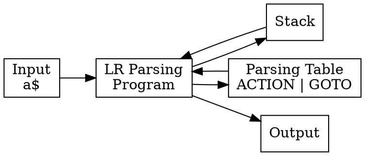

## Chapter 2: Syntactic Analysis

### 2.1 Introduction to Syntax Analysis

Syntax analysis (parsing) checks if the token sequence conforms to the grammar rules and builds a parse tree.

**Input:** Token stream from lexical analyzer  
**Output:** Parse tree or syntax tree

### 2.2 Context-Free Grammars (CFG)

A grammar $G$ is defined as: $G = (N, T, P, S)$

- $N$: Set of non-terminals
- $T$: Set of terminals (tokens)
- $P$: Set of production rules
- $S$: Start symbol

**Example Grammar:**
```
E → E + T | T
T → T * F | F
F → (E) | id
```


**$ N $ (Non-terminals)**:  
  $ \{ E, T, F \} $  
  → These are variables that can be expanded.

**$ T $ (Terminals)**:  
  $ \{ +, *, (, ), \text{id} \} $  
  → These are literal symbols in the language (operators, parentheses, identifiers).

**$ P $ (Production Rules)**:  
  $$
  \begin{align*}
  E &\to E + T \\
  E &\to T \\
  T &\to T * F \\
  T &\to F \\
  F &\to (E) \\
  F &\to \text{id}
  \end{align*}
  $$

**$ S $ (Start Symbol)**:  
  $ E $  
  → The grammar starts with `E`.

---


### 2.3 Derivations and Parse Trees

**Leftmost Derivation:** Always expand the leftmost non-terminal first  
**Rightmost Derivation:** Always expand the rightmost non-terminal first

**Example for `id + id * id`:**

Leftmost derivation:
```python
E
⇒ E + T              (expand **E → E + T**)
⇒ T + T              (expand **leftmost E → T**)
⇒ F + T              (expand **leftmost T → F**)
⇒ id + T             (expand **F → id**)
⇒ id + T * F         (expand **T → T * F**)
⇒ id + F * F         (expand **leftmost T → F**)
⇒ id + id * F        (expand **F → id**)
⇒ id + id * id       (expand **F → id**)
```


Rightmost derivation:
```python
E
⇒ E + T             (use E → E + T)
⇒ E + T * F         (expand rightmost T → T * F)
⇒ E + T * id        (expand F → id)
⇒ E + F * id        (expand rightmost T → F)
⇒ E + id * id       (expand F → id)
⇒ T + id * id       (expand E → T)
⇒ F + id * id       (expand T → F)
⇒ id + id * id      (expand F → id)
```

### 2.4 Problems in Grammar Design

#### 2.4.1 Ambiguity

A grammar is ambiguous if there exists a string with two or more distinct parse trees.

**Ambiguous Grammar:**
```python
E → E + E
E → E * E
E → id
```

For the string `id + id * id`, we can have:

`(id + id) * id`  
`id + (id * id)`

**Solution:** Use precedence and associativity rules.

**Fix (Unambiguous Grammar):**
```
E → E + T | T
T → T * F | F
F → id
```

#### 2.4.2 Left Recursion

A grammar is **left-recursive** if a nonterminal `A` can derive a string that begins with itself, i.e. `A ⇒⁺ Aα`.

**Problem:**
Top-down parsers can fall into **infinite recursion** when handling left-recursive rules.

**Example:**

```
E → E + T | T
```

Here, `E` is left-recursive because the production `E → E + T` starts with `E`.

**Elimination Algorithm:**
For a rule of the form:

```c
A → Aα | β //   βαααα..α | β
```

We rewrite it as:

```
A  → βA'
A' → αA' | ε
```

**After elimination:**

```
E  → TE'
E' → +TE' | ε
```

Now the grammar is **right-recursive**, avoiding infinite loops in top-down parsing.


#### 2.4.3 Left Factorization

When two productions start with the same prefix, parser cannot decide which to use.

**Example:**
```
S → if E then S else S | if E then S
```

**Factorization:**
```
S → if E then S S'
S' → else S | ε
```

### 2.5 First and Follow Sets

#### 2.5.1 First Set

**FIRST(α):** Set of terminals that can appear as the first symbol in strings derived from α.

**Rules:**

1. If X is terminal: `FIRST(X) = {X}`
2. If X → ε add ε to `FIRST(X)`
3. If X → Y₁Y₂...Yₖ:

   * Add `FIRST(Y₁) - {ε}` to `FIRST(X)`
   * If Y₁ ⇒* ε, add `FIRST(Y₂) - {ε}`
   * Continue until a non-nullable symbol or all symbols processed

**Example:**

```
E → TE'
E' → +TE' | ε
T → FT'
T' → *FT' | ε
F → (E) | id
```

**Calculation:**

```
FIRST(F) = {(, id}
FIRST(T) = FIRST(F) = {(, id}
FIRST(E) = FIRST(T) = {(, id}
FIRST(E') = {+, ε}
FIRST(T') = {*, ε}
```

#### 2.5.2 Follow Set

**FOLLOW(A):** Set of terminals that can appear immediately after A.

**Rules:**

1. Place `$` in `FOLLOW(S)` where S is the start symbol.
2. If A → αBβ, add `FIRST(β) - {ε}` to `FOLLOW(B)`.
3. If A → αB or (A → αBβ and ε ∈ FIRST(β)), add `FOLLOW(A)` to `FOLLOW(B)`.

**Example (same grammar):**

```
FOLLOW(E)  = {), $}
FOLLOW(E') = {), $}
FOLLOW(T)  = {+, ), $}
FOLLOW(T') = {+, ), $}
FOLLOW(F)  = {*, +, ), $}
```

### 3.2 Top-Down Parsing

#### 3.2.1 Recursive Descent Parsing

Each non-terminal has a corresponding parsing function.

**Grammar:**
```
E → TE'
E' → +TE' | ε
T → FT'
```

**Pseudo-code:**
```c
void E() {
    T();
    E_prime();
}

void E_prime() {
    if (lookahead == '+') {
        match('+');
        T();
        E_prime();
    }
    // else do nothing → ε-production
}

void T() {
    F();
    T_prime();
}
```

#### 3.2.2 LL(1) Parsing

**LL(1):** Left-to-right scan, Leftmost derivation, 1 lookahead symbol.

#### 3.2.2 LL(1) Parsing

**LL(1):** Left-to-right scan, Leftmost derivation, 1 lookahead symbol.

**LL(1) Parsing Table Construction:**

For each production **A → α**:

1. For each terminal *a* in `FIRST(α)`: add **A → α** to **M[A, a]**.
2. If ε ∈ `FIRST(α)`: for each *b* in `FOLLOW(A)`, add **A → α** to **M[A, b]**.


**Example Grammar:**

```
E  → TE'
E' → +TE' | ε
T  → FT'
T' → *FT' | ε
F  → (E) | id
```

**FIRST and FOLLOW sets:**

```
FIRST(E)  = {(, id}
FIRST(E') = {+, ε}
FIRST(T)  = {(, id}
FIRST(T') = {*, ε}
FIRST(F)  = {(, id}

FOLLOW(E)  = {), $}
FOLLOW(E') = {), $}
FOLLOW(T)  = {+, ), $}
FOLLOW(T') = {+, ), $}
FOLLOW(F)  = {*, +, ), $}
```

**LL(1) Parsing Table:**

| NTs | id       | +           | *           | (         | )      | $      |
| ------------ | -------- | ----------- | ----------- | --------- | ------ | ------ |
| **E**        | E → TE' |             |             | E → TE'  |        |        |
| **E'**       |          | E' → +TE' |             |           | E' → ε | E' → ε |
| **T**        | T → FT' |             |             | T →  T'  |        |        |
| **T'**       |          | T' → ε      | T' → *FT' |           | T' → ε | T' → ε |
| **F**        | F → id   |             |             | F → (E) |        |        |


**LL(1) Condition:**
A grammar is **LL(1)** if **each cell in the parsing table contains at most one production rule**, ensuring there are no parsing conflicts.


### 4.1 Bottom-Up Parsing

Bottom-up parsing builds the parse tree from leaves to root (reverse of derivation).

**Key Concepts:**
- **Handle:** Substring matching the right side of a production
- **Reduction:** Replacing handle with left side non-terminal
- **Shift-Reduce Actions:**
  - **Shift:** Move next input symbol onto stack
  - **Reduce:** Replace handle on stack with non-terminal
  - **Accept:** Parsing completed successfully
  - **Error:** Syntax error detected

### 4.2 LR Parsing

**LR(k):** Left-to-right scan, Rightmost derivation in reverse, k lookahead symbols

**LR Parser Components:**


### 4.3 LR(0) Items

An **LR(0) item** is a production with a dot (•) indicating parsing position.

**For production A → XYZ, items are:**
```
A → •XYZ
A → X•YZ
A → XY•Z
A → XYZ•
```

### 4.4 SLR(1) Parsing

**Simple LR(1):** Uses FOLLOW sets to resolve conflicts.

**Construction Steps:**
1. Build canonical collection of LR(0) items
2. Construct parsing table using FOLLOW sets

**Example Grammar:**
```
S' → S
S → CC
C → cC | d
```

**Item Sets (I₀, I₁, ...):**

I₀:
```
S' → •S
S → •CC
C → •cC
C → •d
```

**SLR Parsing Table:**

| State | c   | d   | $   | S   | C   |
|-------|-----|-----|-----|-----|-----|
| 0     | s3  | s4  |     | 1   | 2   |
| 1     |     |     | acc |     |     |
| 2     | s6  | s7  |     |     | 5   |
| 3     | s3  | s4  |     |     | 8   |
| 4     | r3  | r3  | r3  |     |     |
| 5     |     |     | r1  |     |     |
| 6     | s6  | s7  |     |     | 9   |
| 7     | r3  | r3  | r3  |     |     |
| 8     | r2  | r2  | r2  |     |     |
| 9     | r2  | r2  | r2  |     |     |

### 4.5 LR(1) Parsing

**Canonical LR(1):** Items include lookahead symbol.

**LR(1) Item Format:** `[A → α•β, a]`
- Production with dot position
- Lookahead terminal a

**More powerful than SLR(1) but larger tables.**

### 4.6 LALR(1) Parsing

**Look-Ahead LR(1):** Merges LR(1) states with same core.

**Advantages:**
- Smaller tables than LR(1)
- More powerful than SLR(1)
- Used by YACC/Bison

**Comparison:**

| Method   | Power   | Table Size |
|----------|---------|------------|
| SLR(1)   | Weakest | Small      |
| LALR(1)  | Medium  | Medium     |
| LR(1)    | Strongest| Large     |

</br>
</br>
</br>
</br>
</br>