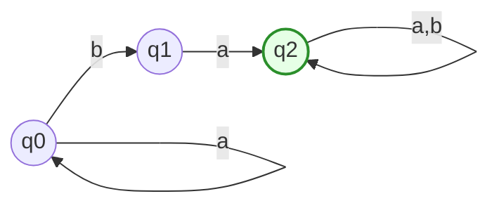
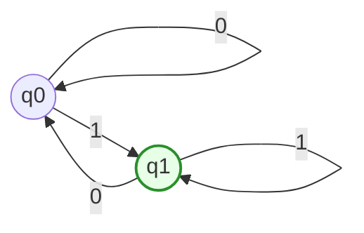
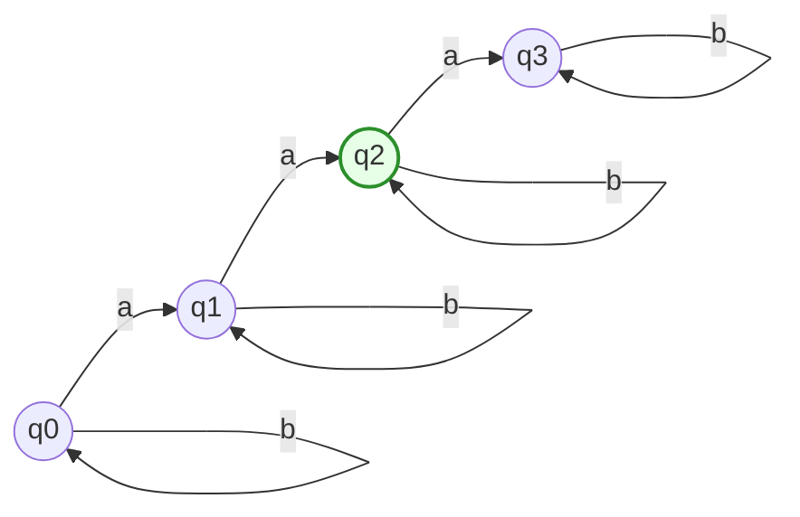
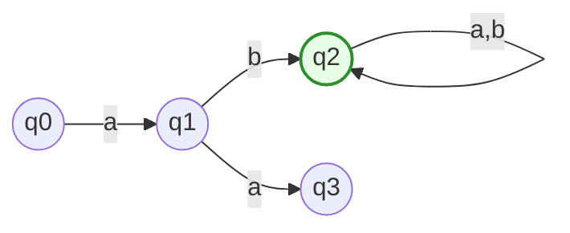
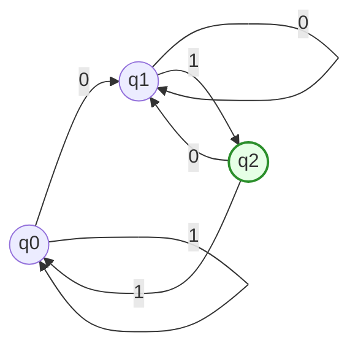

# TD01 — Solutions

**Course:** Compilation / Lexical Analysis

**Instructor:** Dr. Anouar Khaldi

---

## Exercise 01 — Fundamental Regular Expressions

Let $\Sigma = {a,b}$.

1. Regular expressions:

   * (a) Strings containing at least one $a$:
     $(a|b)^* a (a|b)^*$
   * (b) Strings that end with $b$:
     $(a|b)^* b$
   * (c) Strings that contain exactly one $a$: $(b)^* a (b)^*$.

2. Examples

* (a) Contain at least one $a$:

  * In: `a`, `ba`, `baba`
  * Not in: `bbb`

* (b) End with $b$:

  * In: `b`, `ab`, `aab`
  * Not in: `aa`

* (c) Exactly one $a$:

  * In: `a`, `bab`, `bbabbb`
  * Not in: `aa` (contains two `a`'s)

---

## Exercise 02 — Describing Languages Formally

Given:

$R_1 = a^*(b ;|; a b a^*)$
$R_2 = (a | b)^* a (a | b)^*$
$R_3 = (a b)^* ;|; (b a)^*$

**Descriptions**:

* $R_1$: Strings consisting of zero or more $a$'s followed either by a single $b$ or by $a b$ followed by zero or more $a$'s. Informally: strings of $a$'s with **one occurrence of $b$ possibly preceded by an $a$**, i.e., strings that contain at least one $b$ where the $b$ may be in contexts `...b` or `...aba...`.

* $R_2$: All strings over ${a,b}$ that contain **at least one $a$**.

* $R_3$: Strings that are entirely repetitions of the block `ab` (possibly empty) or entirely repetitions of the block `ba` (possibly empty). That is, either $(ab)(ab)(ab)...$ or $(ba)(ba)...$.

**Equivalence of $R_1$ and $R_2$**:

They are **not equivalent**. Counterexample: the string `a` belongs to $R_2$ (it contains an `a`) but does not belong to $R_1$ because $R_1$ requires a `b` in the suffix.

---

## Exercise 03 — Regular Definitions and Token Classification

Given definitions:

$Letter = A | B | \dots | Z | a | b | \dots | z$
$Digit = 0 | 1 | \dots | 9$
$Identifier = Letter (Letter | Digit)^*$
$Number = Digit^+ (. Digit^+)? (E (+ | -)? Digit^+)?$

1. **Rewriting `Number` using only union, concatenation, Kleene star**

Replace `+` by `Digit Digit^*` and `?` by union with $\varepsilon$.

$Digit^+ = Digit ; Digit^*$
$(. Digit^+)? = \varepsilon ;|; . ; Digit ; Digit^*$
$(E(+|-) ? Digit^+)? = \varepsilon ;|; E ( ( + | - ) | \varepsilon ) Digit ; Digit^*$

Thus:

$Number = Digit ; Digit^* ; (\varepsilon ; | ; . ; Digit ; Digit^*) ; (\varepsilon ; | ; E ( + ; | ; - ; | ; \varepsilon ) Digit ; Digit^*)$

2. **Keyword `if`**

$Keyword = i; f$

This token matches the exact two-character sequence `if`.

3. **How the lexer differentiates `if` as Keyword from Identifier**

The lexer prioritizes keyword rules. When a lexeme like `if` matches both `Keyword` and `Identifier`, the lexer emits `Keyword`. Otherwise, it emits `Identifier`.

---

## Exercise 04 — Understanding Automaton M1

**Language:** M1 accepts all strings over ${a,b}$ that contain the substring `ba`.
Equivalent regular expression: $(a|b)^* b a (a|b)^*$.

---

## Exercise 05 — DFA M2

Language: all binary strings ending in `1`.
Regular expression: $(0|1)^* 1$.

---

## Exercise 06 — DFA for Exactly Two $a$

Regular expression: $(b)^* a (b)^* a (b)^*$.

---

## Exercise 07 — Automaton M3

Language: strings starting with `a`, containing the substring `ab`.
Regular expression: $a (a|b)^* b (a|b)^*$.

---

## Exercise 08 — DFA for Strings Ending with `01`

Language: binary strings ending with `01`.
Regular expression: $(0|1)^* 0 1$.

---

**End of Solutions**
