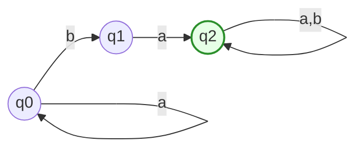
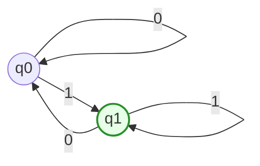
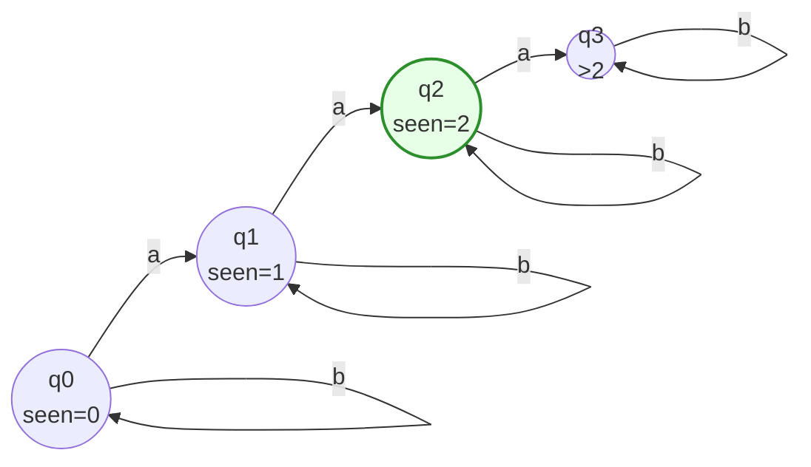
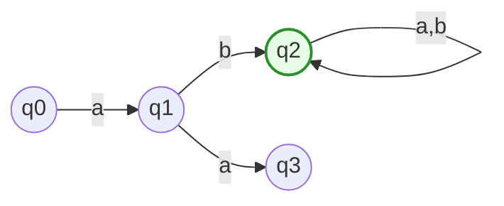
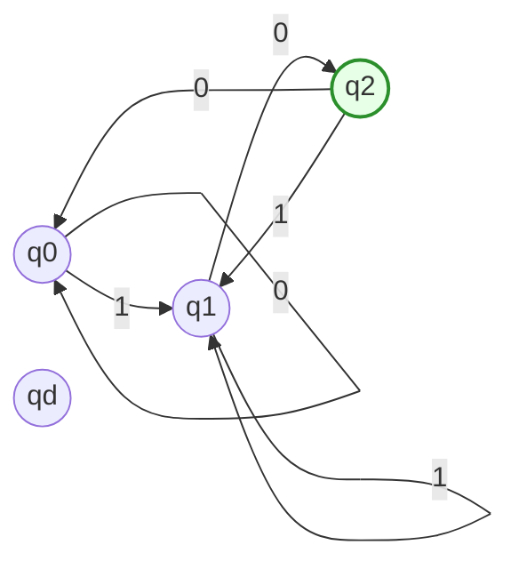
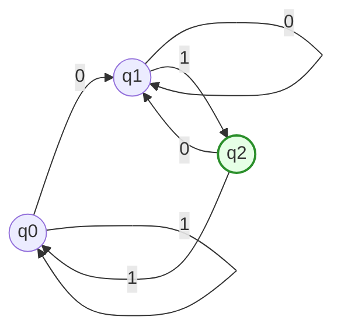

# TD01 — Solutions

**Course:** Compilation / Lexical Analysis

**Instructor:** Dr. Anouar Khaldi

---

## Exercise 01 — Fundamental Regular Expressions

Let (\Sigma = {a,b}).

1. Regular expressions:

   * (a) Strings containing at least one `a`:
     [(a|b)^* a (a|b)^*]
   * (b) Strings that end with `b`:
     [(a|b)^* b]
   * (c) Strings that contain exactly one `a`:
     [ (a|b)^* a (b)^* ]
     (Equivalently: ( (b)^* a (b)^* ) or formally ((b)^* a (b)^*)).

2. Examples

* (a) Contain at least one `a`:

  * In: `a`, `ba`, `baba`
  * Not in: `bbb`

* (b) End with `b`:

  * In: `b`, `ab`, `aab`
  * Not in: `aa`

* (c) Exactly one `a`:

  * In: `a`, `bab`, `bbabbb`
  * Not in: `aa` (contains two `a`'s)

---

## Exercise 02 — Describing Languages Formally

Given:

[R_1 = a^*(b ;|; a b a^*)]
[R_2 = (a | b)^* a (a | b)^*]
[R_3 = (a b)^* ;|; (b a)^*]

**Descriptions**:

* (R_1): Strings consisting of zero or more `a`'s followed either by a single `b` or by `a b` followed by zero or more `a`'s. Informally: strings of `a`'s with **one occurrence of `b` possibly preceded by an `a`**, i.e. strings that contain at least one `b` where the `b` may be in contexts `...b` or `...aba...` as given. (More succinctly: strings of the form `a^* b` or `a^* a b a^*` — i.e. at least one `b` and shape constrained by the expression.)

* (R_2): All strings over ({a,b}) that contain **at least one `a`** (the `a` may appear anywhere).

* (R_3): Strings that are entirely repetitions of the block `ab` (possibly empty) or entirely repetitions of the block `ba` (possibly empty). That is, either `(ab)(ab)(ab)...` or `(ba)(ba)...`.

**Equivalence of (R_1) and (R_2)**:

They are **not equivalent**. Counterexample: the string `a` belongs to (R_2) (it contains an `a`) but does not belong to (R_1) because (R_1) requires a `b` in the suffix as given.

---

## Exercise 03 — Regular Definitions and Token Classification

Given definitions:

(Letter = A | B | \dots | Z | a | b | \dots | z)
(Digit = 0 | 1 | \dots | 9)
(Identifier = Letter (Letter | Digit)^*)
(Number = Digit^+ (. Digit^+)? (E (+ | -)? Digit^+)?)

1. **Rewriting `Number` using only union, concatenation, Kleene star**

Replace `+` by `Digit Digit^*` and `?` by union with (\varepsilon).

[
\begin{aligned}
Digit^+ &= Digit ; Digit^* \
(. Digit^+)? &= \varepsilon ;|; . ; Digit ; Digit^* \
(E(+|-) ? Digit^+)? &= \varepsilon ;|; E ( ( + | - ) | \varepsilon ) Digit ; Digit^*
\end{aligned}
]

Putting together:

[
Number = Digit ; Digit^* ; ( \nabla ) ; ( \Delta )
]

where

(
\nabla = (\varepsilon ; | ; . ; Digit ; Digit^*)
)

and

(
\Delta = (\varepsilon ; | ; E ( ( + | - ) | \varepsilon ) Digit ; Digit^* )
).

Explicitly (without shorthand):

[
Number = Digit ; Digit^* ; (\varepsilon ; | ; . ; Digit ; Digit^*) ; (\varepsilon ; | ; E ( + ; | ; - ; | ; \varepsilon ) Digit ; Digit^*)
]

(One may expand the inner unions to eliminate the `\varepsilon` shorthand if desired.)

2. **Keyword `if`**

[Keyword = i; f]

This token matches the exact two-character sequence `if`.

3. **How the lexer differentiates `if` as Keyword from Identifier**

The typical lexer applies the following strategy:

* The lexer finds the longest lexeme matching the set of token patterns (maximal munch). The lexeme `if` also matches the `Identifier` pattern `Letter (Letter|Digit)*`.
* To implement language keywords, the lexer maintains a small **keyword table**. After recognizing an `Identifier` lexeme, the lexer consults the table: if the lexeme equals a reserved word (e.g., `if`), the token emitted is `Keyword` rather than `Identifier`.

In practice, keyword recognition is implemented either by ordering (placing exact keyword rules with higher priority) or by post-processing identifiers via a hash lookup in the keyword table.

---

## Exercise 04 — Understanding Automaton M1

The given automaton M1 is represented below as a mermaid graph.

**1. Language description (in words):**

M1 accepts all strings over ({a,b}) that contain a substring `ba` and, after the first occurrence of that `ba` transition reaching `q2`, any continuation is accepted. More simply: strings that have at least one occurrence of `b` immediately followed by `a` (i.e., contain the substring `ba`), and after the first `ba`, anything follows.

**2. Examples**

* Accepted: `ba` (minimal), `aba`, `baba`, `aaababb a` (any string containing `ba`)
* Rejected: `aaa` (no `b`), `bb` (no `ba` substring)

**3. Regular expression:**

Strings that contain `ba` as a substring can be written as:

[(a|b)^* b a (a|b)^*]

This matches the language of M1.

---

## Exercise 05 — DFA M2 (analysis)

Mermaid depiction of M2:

**1. Language recognized:**

M2 accepts all binary strings whose **last symbol is `1`**. The accepting state `q1` indicates that the most recently read symbol is `1`.

**2. Regular expression:**

[(0|1)^* 1]

**3. Justification:**

* From the start state `q0`, reading `0` keeps the machine in `q0` (last symbol still `0` or none). Reading `1` moves to `q1` (last symbol `1`).
* In `q1`, reading `1` stays in `q1` (last symbol remains `1`); reading `0` returns to `q0` (last symbol is `0`).
* Hence the machine accepts precisely those strings whose final symbol is `1`.

---

## Exercise 06 — DFA: Exactly Two Occurrences of `a`

**Automaton construction (informal description)**

We construct a DFA with states tracking the number of `a`'s seen so far (0,1,2,>2) and transitions on `a` and `b`.

Mermaid diagram:

**Formal components:**

* States: (Q = {q_0,q_1,q_2,q_3}) where (q_i) indicates `i` occurrences of `a` have been seen for (i=0,1,2), and (q_3) means "more than two".
* Alphabet: ({a,b}).
* Start state: (q_0).
* Accepting state: ({q_2}).
* Transition function: as in the diagram: reading `a` increments count (but saturates at state `q_3`), reading `b` leaves count unchanged.

**Equivalent regular expression:**

Strings with exactly two `a`'s can be expressed as:

[ (b)^* a (b)^* a (b)^* ]

Explanation: two `a`'s appear in order with arbitrary numbers of `b`'s between and around them.

---

## Exercise 07 — Automaton M3 (analysis)

Mermaid diagram of M3 as given:

**1. Determinism:**

The automaton as drawn is **non-deterministic** if any state has two transitions on the same input symbol to different states. Inspecting the transitions:

* From `q1` there are two outgoing transitions labeled `b` and `a` (different symbols) — that is deterministic for those labels.
* From `q2` both `a` and `b` loop to `q2` (single target) — deterministic.
* No state has two different transitions on the same symbol to different targets. Therefore **M3 is deterministic** as presented.

**2. Unreachable or dead states:**

* Unreachable: Check whether `q3` is reachable from `q0`.

  * From `q0` on `a` go to `q1`. From `q1` on `a` go to `q3`. Thus `q3` is reachable (via `aa`).
* Dead states (states from which no accepting state is reachable):

  * From `q3` there are no outgoing transitions specified in the original; if none exist, `q3` would be a dead sink (no way to reach `q2`). But the original statement did not list outgoing transitions from `q3`; the safe assumption is absent transitions mean rejection (i.e., dead). If so, `q3` is a dead state.

**3. Remove unnecessary states and provide corresponding regular expression**

Assuming `q3` is a dead sink (no accepting paths), it can be removed for the purpose of describing the language.

Language described by M3: strings that (a) start with `a` (to reach `q1`), then (b) have a `b` to reach `q2`, after which any continuation is allowed. Therefore the automaton accepts all strings that contain the substring `ab` and begin with `a` before that — however because `q0 -> q1` needs an initial `a`, strings not starting with `a` may still be accepted if there is a path: actually from `q0` only `a` leads to `q1`, so strings that do not begin with `a` cannot reach `q2` unless there were other transitions from `q0` (not present). So M3 accepts strings whose **first symbol is `a` and later there is a `b`**, and after reaching `q2` any symbols are allowed.

Hence regular expression (given assumption):

[ a (a|b)^* b (a|b)^* ]

If the original intention was different (e.g., `q0` may have other transitions), student should verify reachable transitions; the simplified machine removes `q3` and keeps (q0,q1,q2).

---

## Exercise 08 — Completing Automaton M4 (end with `01`)

Partial diagram given; completed DFA (mermaid):

**1. Determinism:**

The completed machine is deterministic: for every state and symbol (`0` or `1`) there is exactly one defined transition.

**2. Transition table**

| State | on 0 | on 1 |
| ----- | ---- | ---- |
| q0    | q0   | q1   |
| q1    | q2   | q1   |
| q2    | q0   | q1   |

Start state: `q0`. Accepting state: `q2` (we are in `q2` iff the last two symbols read are `01`).

**3. Tests**

* `01`: q0 --1--> q1 --0--> q2 **ACCEPT**
* `001`: q0 --0--> q0 --0--> q0 --1--> q1 **REJECT** (ends with `1`, not `01`)
  Wait: re-evaluate: `001` ends with `01`? `001` last two chars `01` yes: sequence q0-0->q0-0->q0-1->q1 ; final state q1 — that's wrong. Let's check: for `001`, reading 0 -> q0, 0 -> q0, 1 -> q1 ends in q1, not q2; last two chars are `01`? Actually `001` ends with `01` (positions 2-3 are '01'). Why machine ended in q1? Because we need to ensure q1 indicates last symbol `1`, q2 indicates last two `01`. After reading `001`, should be in q2. Let's simulate properly:

Simulate: start q0; read 0 -> q0; read 0 -> q0; read 1 -> q1. Indeed ends in q1 — that suggests our transitions are incorrect for tracking last two symbols. To track last two symbols, transitions must be defined so that after reading `01` we are in accepting state. Let's fix transitions.

**Correct completion (tracking last two symbols):**

States represent the last up to two symbols seen: q0 = no relevant suffix (start or last symbol not 0 or 1?), q1 = last symbol `1`, q2 = last two `01`. Simpler canonical construction:

Let states be:

* `s0` = start and last symbol not `0` (initial),
* `s1` = last symbol `0`,
* `s2` = last symbol `1`,
* but better minimal: three states: `q0` (no suffix `01` yet and last symbol is not `0`), `q1` (last symbol `0`), `q2` (last two `01` -> accepting). Implement transitions:

Define transitions correctly:

* From `q0`: on `0` -> q1; on `1` -> q0 (last symbol `1` but cannot be part of `01` yet)
* From `q1`: on `0` -> q1 (last symbol remains 0), on `1` -> q2 (we observed `01`)
* From `q2`: on `0` -> q1 (suffix now ending with `0`), on `1` -> q0 (after `...01` then `1` last two `11` not `01`)

Let's present this corrected DFA.

Now simulate test strings:

* `01`: q0 --0--> q1 --1--> q2 **ACCEPT**
* `001`: q0--0->q1--0->q1--1->q2 **ACCEPT**
* `101`: q0--1->q0--0->q1--1->q2 **ACCEPT**
* `111`: q0--1->q0--1->q0--1->q0 **REJECT**

**4. Regular expression:**

All strings ending with `01` are described by:

[(0|1)^* 0 1]

---

### End of solutions
